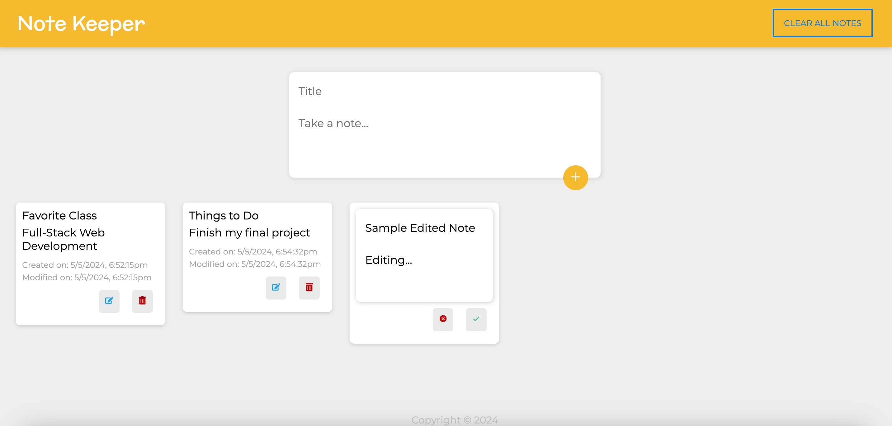

# coms-3102-final-project

## Description

This full-stack note taking application is the final project for COMS 3102 (Full-Stack Web Development) at Columbia University. This app allows users to create, save, edit, and delete notes in a similar manner to Google Keep. Notes are retained between refreshes, but since authentication has not been implemented, all users share a single set of notes.

This app uses the MERN stack (MongoDB, Express, React, Node), and this repository contains both the server-side and client-side for the app.

### Deployment

Currently, both the client and server are deployed using Vercel. The frontend code (and the main app) is deployed at https://coms-3102-final-project-client.vercel.app/, while the backend code is deployed at https://coms-3102-final-project-server.vercel.app/. To note, for the backend code, Vercel converted the Express.js routes to serverless functions.

### Preview



### Getting Started

Here are the steps to work on this project locally:

#### Prerequisites

- Node.js >= 18.0.0
- npm >= 8.0.0

#### Setup

1. Clone the repository
   `git clone https://github.com/jimmyzhang2003/coms-3102-final-project.git`
2. Check that Node.js and npm are installed
   ```
   node -v
   npm -v
   ```
3. Create a new project in MongoDB and obtain a connection string.

#### Server

1. Enter server directory
   `cd server`
2. Create a .env file and add "MONGO_DB_URI=<YOUR_MONGO_DB_CONNECTION_STRING>" to it
   `touch .env`
3. Install dependencies
   `npm install`
4. Start the Node.js server application
   `npm run start`

#### Client

1. Enter client directory
   `cd client`
2. Install dependencies
   `npm install`
3. Start the React.js client application
   `npm run start`
